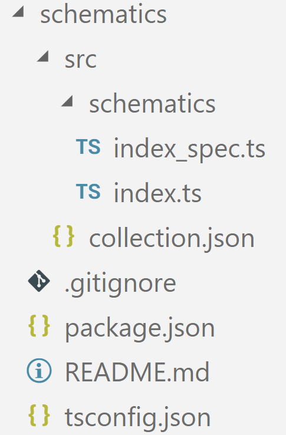
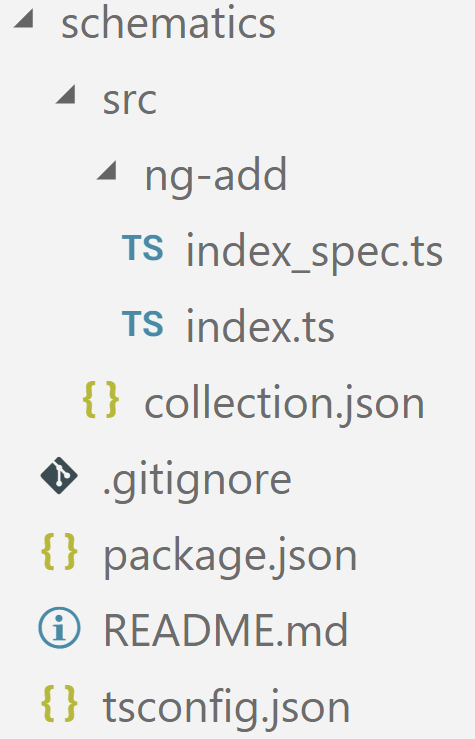
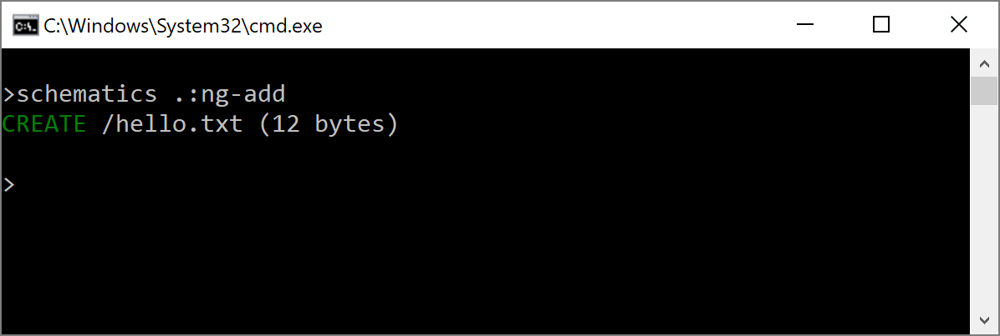
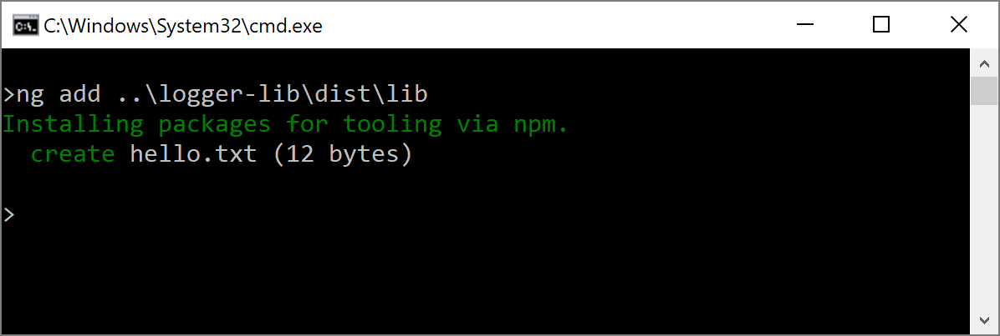
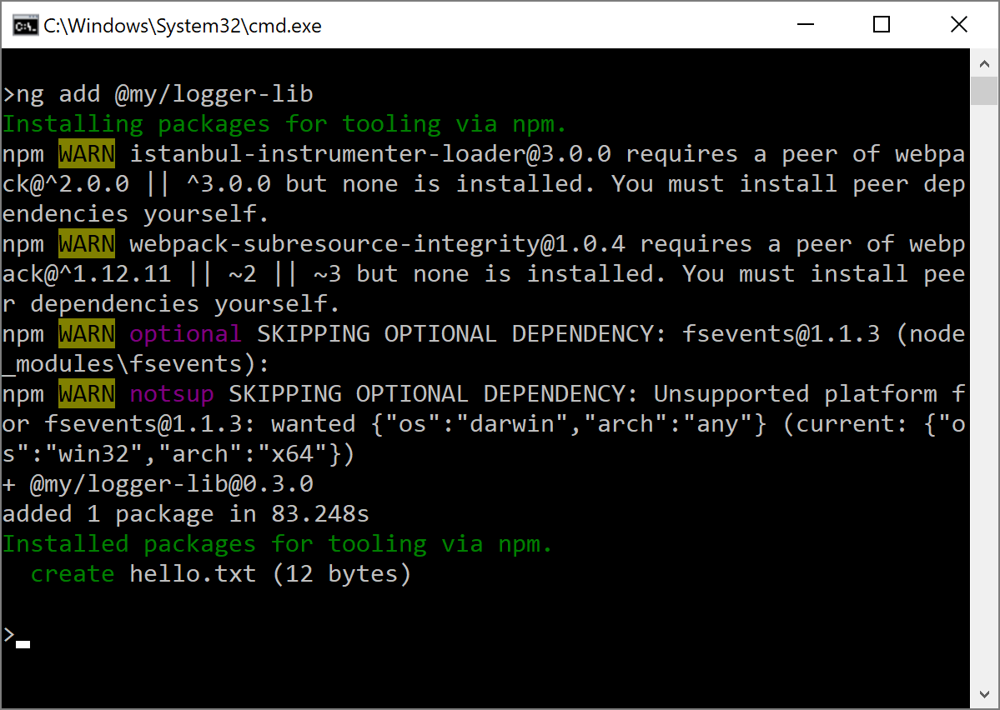
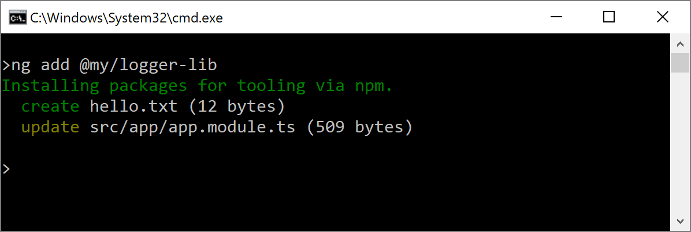

# Custom Schematics - Part IV: Frictionless Library Setup with the Angular CLI and Schematics

It's always the same: After npm installing a new library, we have to follow a readme step by step to include it into our application. Usually this involves creating configuration objects, referencing css files and importing Angular Modules. As such tasks aren't fun at all it would be nice to automate this.

This is exactly what the Angular CLI supports beginning with Version 6 (Beta 5). It gives us a new ``ng add`` command that fetches an npm package and sets it up with a schematic -- a code generator written with the CLI's scaffolding tool [Schematics](https://blog.angular.io/schematics-an-introduction-dc1dfbc2a2b2). To support this, the package just needs to name this schematic ``ng-add``.

In this article, I show you how to create such a package. For this, I'll use [ng-packagr](https://github.com/dherges/ng-packagr) and a custom schematic. You can find the [source code](https://github.com/manfredsteyer/schematics-ng-add) in [my GitHub account](https://github.com/manfredsteyer/schematics-ng-add).

If you haven't got an overview to Schematics so far, you should lookup the well written [introduction in the Angular Blog]([Schematics](https://blog.angular.io/schematics-an-introduction-dc1dfbc2a2b2)) before proceeding here.

## Goal

To demonstrate how to leverage ``ng add``, I'm using an example with a very simple logger library here. It is complex enough to explain how everything works and not indented for production. After installing it, one has to import it into the root module using ``forRoot``:

```TypeScript
[...]
import { LoggerModule } from '@my/logger-lib';

@NgModule({
  imports: [
    [...],
    LoggerModule.forRoot({ enableDebug: true })
  ],
  [...]
})
export class AppModule { }
```

As you see in the previous listing, ``forRoot`` takes a configuration object. After this, the application can get hold of the ``LoggerService`` and use it:

```TypeScript
[...]
import { LoggerService } from '@my/logger-lib';

@Component({
  selector: 'app-root',
  templateUrl: './app.component.html'
})
export class AppComponent {

  constructor(private logger: LoggerService) {
    logger.debug('Hello World!');
    logger.log('Application started');
  }
}
```

To prevent the need for importing the module manually and for remembering the structure of the configuration object, the following sections present a schematic for this.

## Getting started

To get started, you need to install version 6 of the Angular CLI. Make sure to fetch Beta 5 or higher:

```
npm i -g @angular/cli@~6.0.0-beta
```

You also need the Schematics CLI:

```
npm install -g @angular-devkit/schematics-cli
```

The above mentioned logger library can be found in the ``start`` branch of my sample:

```
git clone https://github.com/manfredsteyer/schematics-ng-add
cd schematics-ng-add
git checkout start
```

After checking out the ``start`` branch, npm install its dependencies:

```
npm install
```

If you want to learn more about setting up a library project from scratch, I recommend the resources outlined in the [readme of ng-packagr](https://github.com/dherges/ng-packagr).

## Adding an ng-add Schematic 

As we have everything in place now, let's add a schematics project to the library. For this, we just need to run the ``blank`` Schematics in the project's root:

```
schematics blank --name=schematics
```

This generates the following folder structure:

{:width=300}

The folder ``src/schematic`` contains an empty schematic. As ``ng add`` looks for an ``ng-add`` schematic, let's rename this folder:



The ``index.ts`` file in the ``ng-add`` folder contains a factory function. It generates a rule setting up the library. I've adjusted its name to ``ngAdd`` and added a line for generating a ``hello.txt``.

```TypeScript
import { Rule, SchematicContext, Tree } from '@angular-devkit/schematics';

export function ngAdd(): Rule {
  return (tree: Tree, _context: SchematicContext) => {
    tree.create('hello.txt', 'Hello World!');
    return tree;
  };
}
```

The generation of the ``hello.txt`` file represents the tasks for setting up the library. We will replace it later with a respective implementation.

As our schematic will be looked up in the ``collection.json`` later, we have also to adjust it:

```json
{
  "$schema": "../node_modules/@angular-devkit/schematics/collection-schema.json",
  "schematics": {
    "ng-add": {
      "description": "Initializes Library",
      "factory": "./ng-add/index#ngAdd"
    }
  }
}
```

Now, the name ``ng-add`` points to our rule -- the ``ngAdd`` function in the ``ng-add/index.ts`` file. 

## Adjusting the build script

In the current project, ``ng-packagr`` is configured to put the library build out of our sources in the folder ``dist/lib``. The respective settings can be found within the ``ngPackage`` node in the ``package.json``. When I'm mentioning  ``package.json`` here, I'm referring to the project root's ``package.json`` and not to the generated one in the ``schematics`` folder.

To make use of our schematic, we have to make sure it is compiled and copied over to this folder. For the latter task, I'm using the ``cpr`` npm package we need to install in the project's root:

```
npm install cpr --save-dev
```

In order to automate the mentioned tasks, add the following scripts to the ``package.json``:

```json
[...]
"scripts": {
  [...],
  "build:schematics": "tsc -p schematics/tsconfig.json",
  "copy:schematics": "cpr schematics/src dist/lib/schematics --deleteFirst",
  [...]
},
[...]
```

Also, extend the ``build:lib`` script so that the newly introduced scripts are called:

```json
[...]
"scripts": {
  [...]
  "build:lib": "ng-packagr -p package.json && npm run build:schematics && npm run copy:schematics",
  [...]
},
[...]
```

When the CLI tries to find our ``ng-add`` schematic, it looks up the ``schematics`` field in the ``package.json``. By definition it points to the ``collection.json`` which in turn points to the provided schematics. Hence, let's add this field to our package.json too:

```json
{
  [...],
  "schematics": "./schematics/collection.json",
  [...]
}
```

Please note that the mentioned path is relative to the folder ``lib`` where ``ng-packagr`` copies the ``package.json`` to.

## Test the Schematic directly

For testing the schematic, let's build the library:

```
npm run build:lib
```

After this, move to the ``dist/lib`` folder and run the schematic:

```
schematics .:ng-add
```



Even though the output mentions that a ``hello.txt`` is generated you won't find it, because when executing a schematic locally it's performing a dry-run. To get the file, set the debug switch to false:

```
schematics .:ng-add --debug false
```

After we've seen that this works, generate a new project with the CLI to find out whether our library plays together with the new ``ng add``:

```
ng new demo-app
cd demo-app
ng add ..\logger-lib\dist\lib
```


Make sure, to point to our ``dist/lib`` folder. Because I'm working on Windows, I've used backslashes here. For Linux or Mac, replace them with forward slashes. 

When everything worked, we should see a ``hello.txt``.

## Test the Schematic via an npm registry

Now, as we know that everything works locally, let's also check whether it works when we install it via an npm registry. For this, we can for instance use verdaccio -- a very lightweight node-based implementation. You can directly npm install it:

```
npm install -g verdaccio
```

After this, it is started by simply running the ``verdaccio`` command:


Before we can publish our library to verdaccio, we have to remove the ``private`` flag from our ``package.json`` or at least set it to ``false``:

```json
{
  [...]
  "private": false,
  [...]
}
```

To publish your library to this verdaccio instance, move to your project's ``dist/lib`` folder and run ``npm publish``:

```
npm publish --registry http://localhost:4873
```

Don't forget to point to ``verdaccio`` using the registry switch.

Now, let's switch over to the generated demo-app. To make sure our registry is used, create an ``.npmrc`` file in the project's root:

```
@my:registry=http://localhost:4873
```

This entry makes sure that libraries with the ``@my`` scope are looked up in our verdaccio instance.

After this, we can install our logger library:

```
ng add @my/logger-lib
```



When everything worked, we should find our npm installed library in the ``node_modules/@my/logger-lib`` folder and the generated ``hello.txt`` in the root.


## Extend our Schematic

So far, we've created a library with a prototypical ``ng-add`` schematic that is automatically executed when installing it with ``ng add``. As we know that our setup works, let's extend the schematic to setup the ``LoggerModule`` as shown in the beginning. 

Frankly, modifying existing code in a safe way is a bit more complicated than what we've seen before. But I'm sure, we can accomplish this together ;-).

For this challenge, our schematic has to modify the project's ``app.module.ts`` file. The good message is, that this is a common task the CLI performs and hence its schematics already contain the necessary logic. However, when writing this, the respective routines have not been part of the public API, hence we have to fork it.

For this, I've checked out the [Angular DevKit](https://github.com/angular/devkit) and copied the contents of its ``packages/schematics/angular/utility`` folder to my library project's ``schematics/src/utility`` folder. Because those files are subject to change, I've conserved the current state [here](https://github.com/manfredsteyer/devkit-schmatics-utility-03-2018.git).

Now, let's add a Schematics rule for modifying the ``AppModule``. For this, move to our ``schematics/src/ng-add`` folder and add a ``add-declaration-to-module.rule.ts`` file. This file gets an ``addDeclarationToAppModule`` function that takes the path of the ``app.module.ts`` and creates a Rule for updating it:

```typescript
import { Rule, Tree, SchematicsException } from '@angular-devkit/schematics';
import { normalize } from '@angular-devkit/core';
import * as ts from 'typescript';
import { addSymbolToNgModuleMetadata } from '../utility/ast-utils';
import { InsertChange } from "../utility/change";

export function addDeclarationToAppModule(appModule: string): Rule {
    return (host: Tree) => {
      if (!appModule) {
        return host;
      }
  
      const modulePath = normalize('/' + appModule);
  
      const text = host.read(modulePath);
      if (text === null) {
        throw new SchematicsException(`File ${modulePath} does not exist.`);
      }
      const sourceText = text.toString('utf-8');
      const source = ts.createSourceFile(modulePath, sourceText, ts.ScriptTarget.Latest, true);
  
      const changes = addSymbolToNgModuleMetadata(source, modulePath, 'imports', 'LoggerModule', '@my/logger-lib', 'LoggerModule.forRoot({ enableDebug: true })');

      const recorder = host.beginUpdate(modulePath);
      for (const change of changes) {
        if (change instanceof InsertChange) {
          recorder.insertLeft(change.pos, change.toAdd);
        }
      }
      host.commitUpdate(recorder);
  
      return host;
    };
  }
```

Most of this function is borrowed from the Angular DevKit. It reads the module file and calls the ``addSymbolToNgModuleMetadata`` utility function copied from the DevKit. This function finds out what to modify. Those changes are applied to the file.

To make this work, I had to tweak the copied ``addSymbolToNgModuleMetadata`` function a bit. Originally, it imported the mentioned Angular module just by mentioning its name. My modified version has an additional parameter which takes an expression like ``LoggerModule.forRoot({ enableDebug: true })``. This expression is put into the module's ``imports`` array.

Even though this just takes some minor changes, the whole ``addSymbolToNgModuleMetadata`` method is rather long. That's why I'm not showing it in this article, but you can look it up [here](https://github.com/manfredsteyer/schematics-ng-add/blob/master/schematics/src/utility/ast-utils.ts).

After this modification, we can call our ``addDeclarationToAppModule`` rule factory to our schematic:

```TypeScript
import { Rule, SchematicContext, Tree, chain, branchAndMerge } from '@angular-devkit/schematics';
import { addDeclarationToAppModule } from './add-declaration-to-module.rule';

export function ngAdd(): Rule {
  
  return (tree: Tree, _context: SchematicContext) => {

    const appModule = '/src/app/app.module.ts';

    return chain([
      branchAndMerge(chain([
        addDeclarationToAppModule(appModule)
      ])),
    ])(tree, _context);

  };
}
```

Now, we can test our Schematic as shown above. To re-publish it to our npm registry, we have to increase the version number in the ``package.json``. For this, you can make use of ``npm version``:

```
npm version minor
```

After re-building it (``npm run build:lib``) and publishing the new version to verdaccio (``npm publish --registry http://localhost:4873``), we can add it to our ``demo app``:



## Conclusion

An Angular-based library can provide an ``ng-add`` Schematic for setting it up. When installing the library using ``ng add``, the CLI calls this schematic automatically. This innovation has a lot of potential and will lower the entry barrier for installing libraries in the future.


